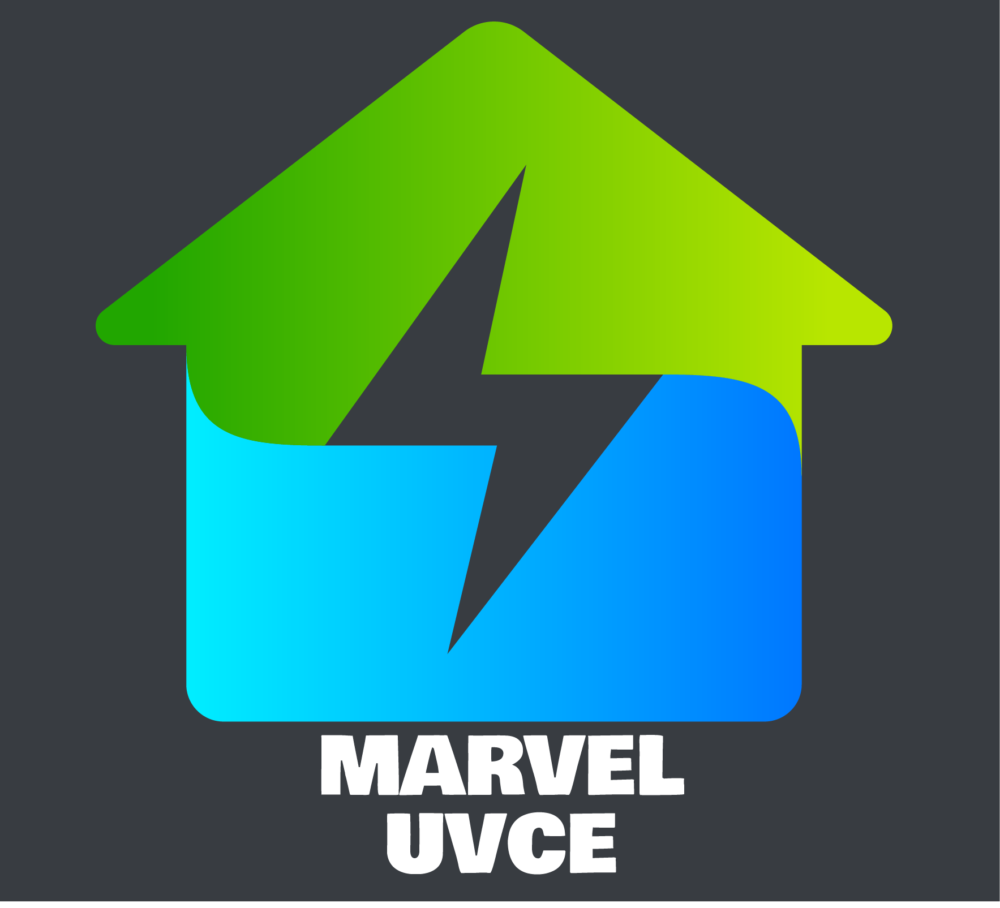

# MARVEL UVCE
## presents a course on Electric Vehicles and Renewable Energy

### Electric Vehicles

Are electric vehicles really as green as they claim to be ? Well, the only way to find out is to learn about them, isn't it? They are worth investigating given their feats over traditional vehicles. Here, are some of their advantages in of EVs.

### Advantages of Electric Vehicles 
- Low maintenance costs
- Less Fuel costs
- Doesn't make noise
- Better handling and  acceleration 
- Doesn't emit any pollutants

### Renewable Energy

What about renewable energy you ask what does that have to with this topic. Well with the given sustainability goals that the world have have made, renewable energy has become quite an interesting topic. Not only because it is better than non-renewable energy sources in most aspects but also because of its growing demand. It's well worth looking into their advantages over non-renewable energy sources.

### Advantages of Renewable Energy
- Environment Friendly
- Creates more job opportunities
- Does not exhaust 
- Less maintainence cost
- Doesn't rely on main power grid

Well, these advantages sure make both EVs and Renewable energy topics enticing and worth looking into. And if you want to join hands with us and learn more about these topics then you are more than welcome.

## Course Details

